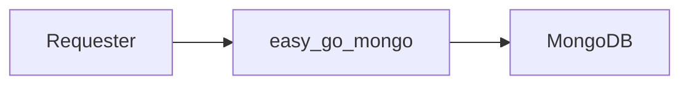

# Easy Go Mongo

## 📘 About

An example golang project for connecting Golang to MongoDB

## 📦 Built With

- [x] GO 1.15
- [x] Viper

## ⚒ Structure



## 🏷 Versions

v0.1.0

- Health Check Status `/api/health`
- MongoDB Connector

## 📋 Features

- `/api/health` | for get health status

## 📝 Test Cases

No Data

## ⚙ Get Started

1. Clone project

    ```bash
    git clone https://ipanda.it.baac.or.th/chinnawat/easy_go_mongo.git
    ```

2. Go to project folder

    ```bash
    cd easy_go_mongo
    ```

3. Set up environment

    ```bash
    export ENV=dev
    ```

4. Run project by command

    ```shell
    # Normal Mode
    go run main.go

    # Test Mode
    go test ./... -v
    ```
